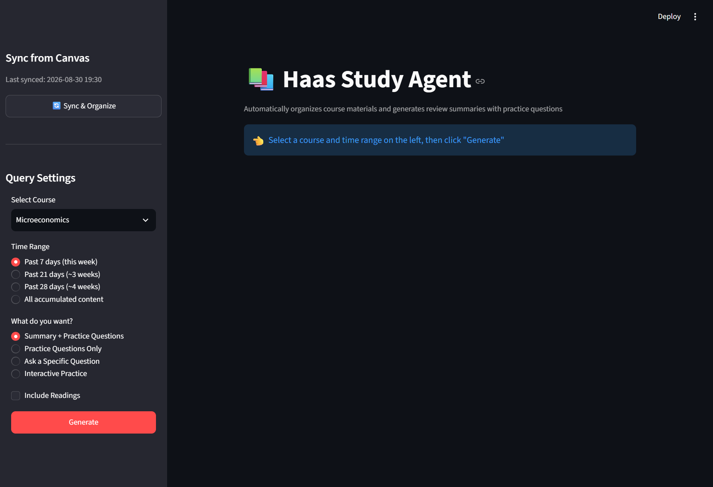
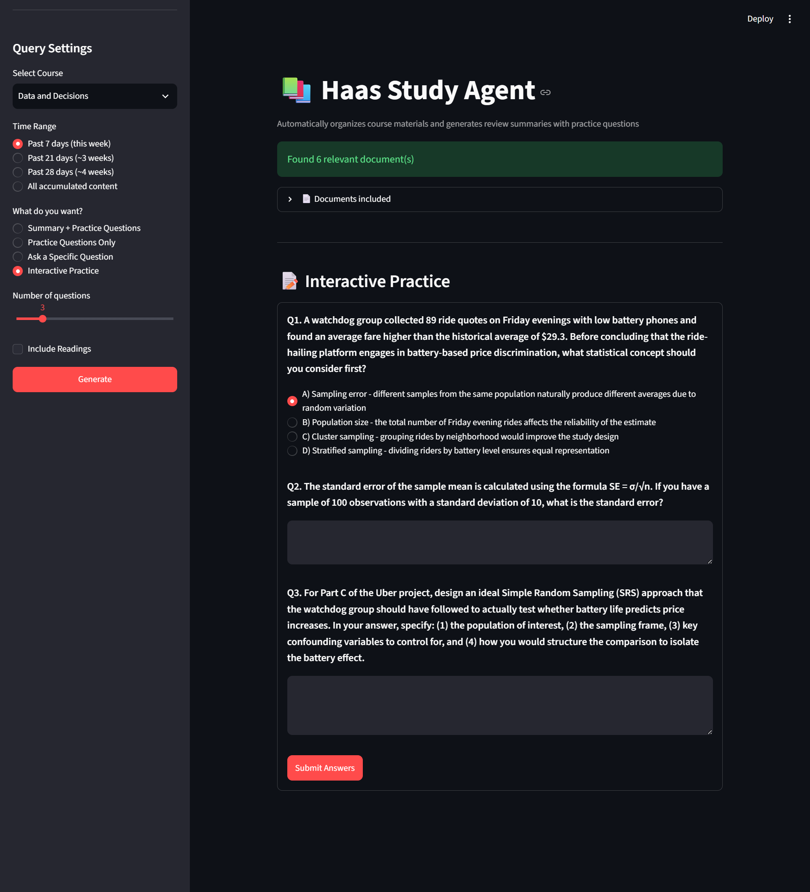

# 📚 Haas Study Agent

An AI agent that automates my MBA coursework workflow — monitoring course materials, classifying them, building a queryable knowledge base, and generating review summaries and interactive practice questions.

**Live demo: (https://mba-study-agent-bryanc.streamlit.app/)

## The Problem

My weekly study routine involved recording lectures, manually downloading materials from Canvas, uploading everything to a notebook, then asking AI to summarize before the next class. Repetitive and time-consuming — so I built an agent to automate it.

## How It Works

Files (from Canvas API or manual upload) → AI classifies by course & type → stored in a SQLite knowledge base → queried through a Streamlit web app for summaries, Q&A, or interactive practice quizzes.

## Tech Stack

Python · Claude API (Sonnet 4.5) · Streamlit · SQLite · watchdog · pdfplumber · Canvas LMS API

## Features

- Automatic classification by course and material type (lecture slides, readings, assignments, syllabus, class notes)
- Handles PDFs, text notes, and Canvas API downloads
- Query by time range (past week, past month, or full semester) — matches weekly review vs. exam prep
- Four modes: summary + questions, questions only, free-form Q&A, interactive practice with AI grading
- One-click Canvas sync from the web interface

## A Few Interesting Bugs I Hit

- **Truncated syllabus:** early versions cut document content to a fixed length before sending to the AI — which silently chopped off a syllabus's exam schedule near the end. Fixed by sending full extracted content instead.
- **Broken math formatting:** Streamlit's markdown renderer treats `$` as LaTeX — so dollar amounts in accounting questions rendered as broken formulas. Fixed by escaping `$` before display.
- **Partial Canvas coverage:** two of four courses have Canvas's Files API disabled by the instructor. Same classification pipeline handles both the automated and manual-upload paths identically.
- **Cloud storage isn't persistent:** Streamlit Community Cloud wipes local files on sleep/reboot — so the hosted version is a demo, and the local instance is where I actually study.

## Setup

1. `pip install -r requirements.txt`
2. Add a `.env` file with `ANTHROPIC_API_KEY`, `CANVAS_API_TOKEN`, `CANVAS_BASE_URL`
3. `streamlit run app.py`

## What's Next

Automated weekly scheduling, a persistent cloud database, and direct Granola integration.